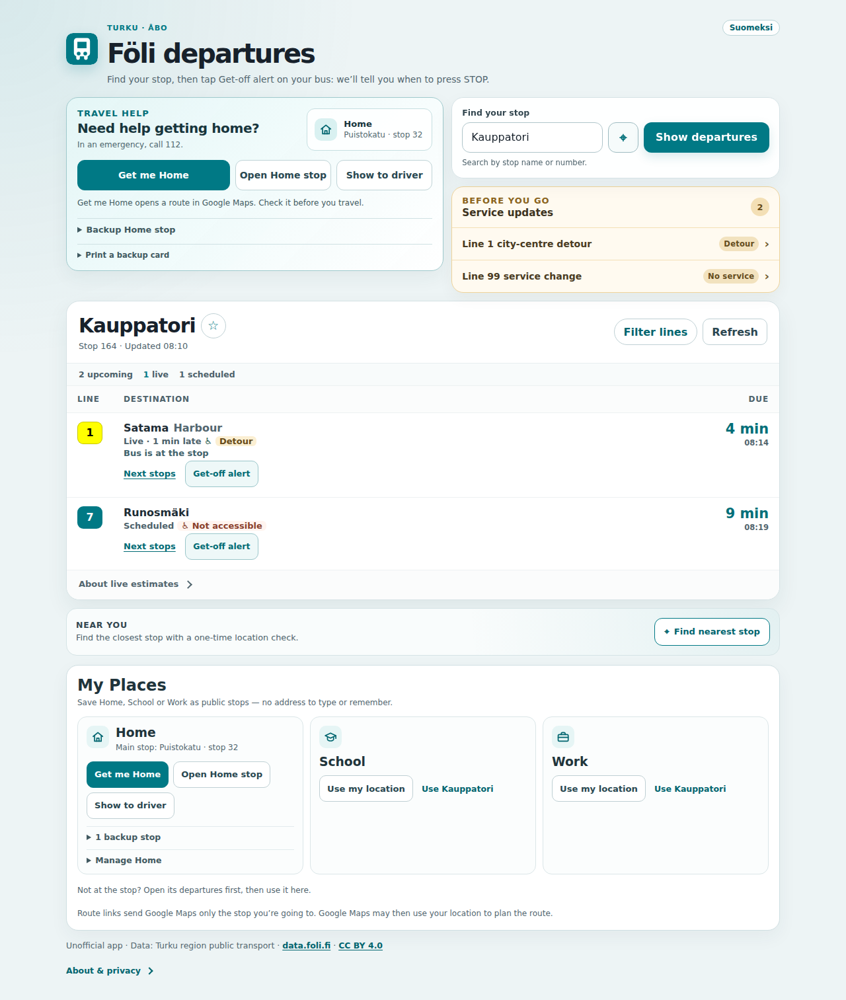

# Föli Live Departures

**Turku bus times, and an alert that tells you when to press STOP.**

Live departures from any Föli stop, the service updates that affect them, and a phone alert before your stop. In Finnish or English, free, with no account.

**Open it:** https://mykoladotsenko.github.io/foli-live-departures/

  <a href="#for-passengers"><strong>For passengers</strong></a>
  ·
  <a href="#suomeksi"><strong>Suomeksi</strong></a>
  ·
  <a href="#for-developers">For developers</a>
  ·
  <a href="docs/PRODUCT_AUDIT.md">Product audit</a>
  ·
  <a href="docs/RIDE_MODE_SPEC.md">Ride Mode design</a>

> An unofficial app, not made by or affiliated with Föli (Turku region public transport) or the City of Turku. The times are Föli open data.

  
  &nbsp;
  
  &nbsp;
  

## For passengers

- **What leaves next.** Search a stop by name or number, or find the nearest one. **Live** times are Föli's estimates from the buses themselves; the rest are the timetable, and the board says which is which.
- **Get off at the right stop.** Tap **Get-off alert** on a departure and choose your stop. The phone tells you when to get ready and when to press STOP, with sound, vibration and speech where it can. Keep the page open: a browser can pause a page it thinks you have left.
- **Before you go.** Detours, cancellations and other service updates for your stop and your lines, above the times they change.
- **Home, School and Work.** Save each as the public stops you use, never an address. **Get me Home** opens the route in Google Maps, **Show to driver** puts your stop on screen in large type with a request in Finnish, and a backup card can be printed for a flat battery.
- **Just your lines.** Tap **Filter lines** at a stop and pick the lines you take, and the board keeps showing only them.
- **When the network drops,** your places and the driver card still open, and the board you just looked at keeps its last times, marked as not live.

  

### Add it to your home screen

- **Android (Chrome):** open the link, then ⋮ → **Add to Home screen** (or **Install app**).
- **iPhone (Safari):** open the link, then Share → **Add to Home Screen**. On iPhone, ride notifications need this.

### Privacy

- No account, no ads, no analytics.
- Favourites, places and each stop's line filter stay on your phone. Clearing the site's data removes them.
- Your location is used to find a stop when you ask, and during a ride while **Follow my location** is on. It stays on the phone and is never saved.
- The page is served by GitHub Pages and the times come from data.foli.fi. Both see your IP address, and data.foli.fi sees which stops and buses you look up. A route link sends Google Maps only the stop you chose; Google Maps may then use your location to plan the route.

The full list is under **About & privacy** at the foot of the app. Feedback is welcome in [GitHub issues](https://github.com/MykolaDotsenko/foli-live-departures/issues).

## Suomeksi

**Turun bussien lähtöajat ja muistutus, kun pitää painaa STOP.**

Pysäkkien reaaliaikaiset lähdöt, niihin vaikuttavat liikennetiedotteet ja muistutus ennen omaa pysäkkiä. Suomeksi tai englanniksi, ilmainen, ei käyttäjätiliä.

**Avaa:** https://mykoladotsenko.github.io/foli-live-departures/

- **Mitä lähtee seuraavaksi.** Hae pysäkki nimellä tai numerolla tai etsi lähin pysäkki. **Reaaliaika**-merkityt ajat ovat Fölin arvioita busseista, muut aikataulun mukaisia, ja taulu kertoo, kumpi on kumpi.
- **Jää pois oikealla pysäkillä.** Napauta lähdön kohdalla **Pysäkkihälytys** ja valitse pysäkkisi. Puhelin kertoo äänellä, värinällä ja puheella, milloin valmistautua ja milloin painaa STOP. Pidä sivu auki: selain voi keskeyttää sivun, jolta se luulee sinun poistuneen.
- **Ennen kuin lähdet.** Pysäkkiäsi ja linjojasi koskevat poikkeusreitit, peruutukset ja muut liikennetiedotteet näkyvät lähtöaikojen yläpuolella.
- **Koti, koulu ja työ.** Tallenna niihin käyttämäsi julkiset pysäkit, ei koskaan osoitetta. **Vie minut kotiin** avaa reitin Google Mapsissa, **Näytä kuljettajalle** näyttää pysäkkisi isolla ja pyynnön suomeksi, ja varakortin voi tulostaa tyhjän akun varalle.
- **Vain omat linjasi.** Napauta pysäkillä **Suodata linjoja** ja valitse linjat, joilla kuljet, niin taulu näyttää vain ne.
- **Kun yhteys katkeaa,** omat paikat ja kuljettajakortti aukeavat yhä, ja juuri katsomasi taulu säilyttää viimeiset aikansa merkittynä vanhoiksi.

### Lisää aloitusnäytölle

- **Android (Chrome):** avaa linkki ja valitse ⋮ → **Lisää aloitusnäytölle** (tai **Asenna sovellus**).
- **iPhone (Safari):** avaa linkki ja valitse Jaa → **Lisää Koti-valikkoon**. iPhonessa matkan ilmoitukset vaativat tämän.

### Tietosuoja

- Ei käyttäjätiliä, ei mainoksia, ei analytiikkaa.
- Suosikit, paikat ja pysäkkien linjasuodattimet pysyvät puhelimessasi. Ne poistuvat, kun tyhjennät sivuston tiedot.
- Sijaintiasi käytetään pysäkin etsimiseen, kun pyydät, ja matkan aikana, kun **Seuraa sijaintiani** on päällä. Se pysyy puhelimessa eikä sitä tallenneta.
- Sivut jakaa GitHub Pages ja ajat tulevat osoitteesta data.foli.fi. Molemmat näkevät IP-osoitteesi, ja data.foli.fi näkee, minkä pysäkkien ja bussien tiedot haet. Reittilinkki kertoo Google Mapsille vain valitsemasi pysäkin; Google Maps voi sitten käyttää sijaintiasi reitin laskemiseen.

Koko luettelo on sovelluksen alareunassa kohdassa **Tietoa ja tietosuoja**.

> Epävirallinen sovellus. Sen tekijä ei ole Föli (Turun seudun joukkoliikenne) eikä Turun kaupunki, eikä se liity niihin.

## For developers

Föli Live Departures answers the everyday transit question quickly — **what leaves next, from where, and is there anything important I should know before I go?**

It also handles less ideal situations: poor connectivity, an unfamiliar area, a child or newcomer trying to get home, a temporarily unavailable stop, stale realtime data, or a provider disruption.

### Core product capabilities

- **Realtime departure board** with conservative Live/Scheduled semantics and stale-data handling
- **Ride Mode get-off alerts** that warn when to get ready, press STOP and exit without continuously watching a map
- **Stop search, favorites and recents** for fast repeat journeys, and a **line filter** kept per stop for the lines you actually take
- **Nearest-stop discovery** with one-time geolocation, uncertainty checks and nearby alternatives
- **Service disruption intelligence** across stop-level, route-level and emergency alerts
- **My Places** for Home, School and Work using public stop identities instead of private addresses
- **Get me Home** recovery with transit handoff, backup stops, driver card and printable no-battery fallback
- **Offline-capable PWA shell** that keeps saved recovery information available when the network disappears
- **Accessible mobile-first UX** validated with Playwright and axe across Chromium, Firefox and WebKit
- **Finnish and English interface** that follows the phone's language, with a one-tap switch; stop and destination names stay exactly as on the bus sign ([localization notes](docs/LOCALIZATION.md))

## Why this project is more than a departure-board demo

The project is intentionally small in infrastructure and demanding in product behavior.

There is **no backend, account system, map SDK, analytics SDK or global state library**. The application instead relies on focused React hooks, browser APIs and explicit provider-boundary normalization.

The harder engineering work is in the edge cases:

- realtime data can become stale without becoming obviously broken
- a failed refresh must not make old departures look fresh
- data from one stop must never appear under another stop
- route disruptions may matter even when no matching realtime row exists
- GPS accuracy can be too poor to safely auto-select a stop
- the physically closest stop can serve the wrong direction
- accessibility and mobile behavior must survive dense realtime content
- offline recovery must remain useful without pretending live transit still works
- browser Back/Forward must switch stops without stale state or render-loop regressions
- get-off alerts must warn early without turning timetable-only evidence into a false “exit now” claim

Those cases are covered by explicit product rules and automated release gates rather than optimistic UI assumptions.

## Stack

| Area | Technology |
| --- | --- |
| UI | React 18, CSS Modules |
| Build | Vite 8 |
| Realtime/data | Axios, Föli SIRI + GTFS + alerts APIs |
| Local state | React hooks, Web Storage |
| Browser capabilities | Geolocation, History, Visibility, Service Worker, Notifications, Wake Lock, Web Audio, Speech Synthesis, Web Share, Clipboard, AbortController |
| Unit/integration tests | Vitest, Testing Library |
| Browser QA | Playwright |
| Accessibility | axe |
| CI | GitHub Actions |
| Delivery model | Installable local-first PWA |

## Product highlights

### Realtime that degrades honestly

The departure board prefers Föli estimated departure/arrival data and falls back to planned times only when needed.

A trip is labelled **Live** only when the provider marks it monitored. The application records when a successful payload reached the browser and advances provider time locally, so an outage cannot freeze an old payload in a misleadingly fresh state.

Temporary provider failures keep useful same-stop data visible while clearly degrading freshness.

### Ride without watching the map

A passenger can choose **Get-off alert** on a concrete departure, select a downstream stop in real trip order and then keep Ride Mode open instead of continuously checking a map.

Ride Mode combines three independent signals:

- **GPS map-matched to the exact GTFS trip shape** for on-device route progress and remaining distance
- **Föli SIRI at the target and previous stop** as an independent realtime confirmation
- **GTFS stop order + anchored timetable** as a degraded fallback when realtime disappears

The selected exit is identified by exact `stop_sequence`, so loop routes do not collapse repeated stops into one ambiguous stop ID. GPS coordinates stay in memory only during the active ride and are never persisted or transmitted.

The state machine is deliberately asymmetric: accurate on-route GPS can warn **SOON** at roughly 1.2 km, **NEXT** at roughly 600 m and **NOW** near 110 m, while SIRI can independently advance the same stages. Weak or off-route GPS is ignored as get-off evidence. Timetable-only data is never allowed to claim “get off now”.

Alerts escalate from a gentle preparation cue to **Press STOP now** on bus-like trips (or a generic next-stop instruction on other transit modes) and finally **This is your stop**, using sound, vibration, speech and system notifications where the browser supports them. Active rides survive a reload, and missed-stop evidence exposes the next planned stop as a recovery action.

Client-only Ride Mode is explicit about its boundary: browsers may suspend background pages, so it does not claim guaranteed lock-screen tracking. The reliability model and the backend + Web Push Phase 2 are documented in **[Ride Mode design](docs/RIDE_MODE_SPEC.md)**.

### Privacy-first My Places

Home, School and Work are each saved as up to three public Föli stops: a main stop and backups the passenger or a parent chose.

The app does not need to persist a private street address or exact setup coordinates. One-time location can help discover nearby public stops; the exact position is discarded after setup.

A shared place contains public stop identity only and requires explicit confirmation before it replaces local data.

### Get me Home recovery

After Home is configured, a dedicated recovery action is promoted near the top of the experience.

It provides independent fallbacks:

- **Get me Home** — external public-transit handoff to the main Home stop
- **Open Home stop** — reopen the local departure board
- **Show to driver** — large destination card with a simple Finnish help sentence
- **Backup Home stops** — user/parent-approved alternatives
- **Print a backup card** — printable public-stop-only recovery card

The interface deliberately describes this as travel help and points to 112 for emergencies.

### Location without overconfidence

Nearest-stop discovery uses one-time browser geolocation and local Haversine calculations.

Automatic selection is withheld when accuracy is poor, the device appears outside the published service area, the network is unexpectedly far away, or two stops are effectively tied inside the uncertainty margin.

The app exposes alternatives because “nearest” does not necessarily mean “correct travel direction”.

### Accessible by design

Accessibility is part of CI rather than a post-build checklist.

The application includes:

- semantic status and alert regions
- accessible combobox/listbox interaction
- keyboard autocomplete
- large mobile touch targets
- visible focus states
- reduced-motion and forced-colors support
- a dark theme that follows the phone's own setting, held to the same axe
  contrast gate as the light one; printing always uses the light theme
- runtime contrast correction for provider-supplied route colors
- screen-reader-aware loading, invalid, busy and pressed states
- WCAG 2 A/AA, 2.1 AA and 2.2 AA serious/critical axe gates

## Architecture

~~~text
Föli SIRI + GTFS + Alerts
        │
        ▼
api/foliApi.js
provider normalization + defensive contracts
        │
        ▼
React hooks
├─ useStopMonitor       realtime polling + stale-data safety
├─ useStopCatalog       stop search + progressive GTFS enrichment
├─ useRouteCatalog      route identity / colors
├─ useStopAlerts        disruption matching
├─ useServiceBoundary   local service-area checks
├─ useSavedStops        favorites / recents
├─ useSavedPlaces       privacy-first My Places
├─ useRideMode          get-off tracking + persistence + GPS redundancy
└─ useOnlineStatus      degraded/offline capability state
        │
        ▼
Product UI
├─ HomeRecovery
├─ BusStopForm
├─ QuickStops
├─ ServiceAlerts
├─ BusStopDisplay
├─ RideSetup / RideMode
├─ NearbyStops
└─ MyPlaces
        │
        ▼
Browser platform
History · Geolocation · Storage · Visibility · Service Worker
~~~

The architecture deliberately avoids a router, backend and global state library because the product scope does not require them. That keeps provider semantics, lifecycle behavior and recovery logic visible and testable.

## Reliability model

The application is defensive around both provider data and browser lifecycle behavior:

- 30-second visible-tab departure refresh
- immediate refresh when returning to the tab
- request cancellation with AbortController
- 8-second HTTP timeouts
- same-stop stale-data retention after transient failures
- strict cross-stop stale-data isolation
- progressive stop catalogue enrichment
- conservative alert refresh and local re-filtering
- no caching of live Föli API responses in the service worker
- content-versioned same-origin PWA shell precache
- explicit online/offline capability messaging
- stable state identities during stop transitions to prevent synchronous render loops
- deterministic browser-history regression coverage

The browser Back/Forward regression is specifically protected after a real production bug was traced to referential instability in pending stop data and alert membership state.

## Quality gates

Every pull request to `master` runs the same production-oriented checks:

| Gate | What it protects |
| --- | --- |
| ESLint | JavaScript/JSX correctness and React Hooks rules |
| Vitest + Testing Library | timing, persistence, privacy, geolocation, alerts and failure semantics |
| Production build | Vite compilation + service-worker generation |
| PWA verification | generated assets are represented in the production precache |
| Bundle budget | prevents uncontrolled frontend growth |
| Playwright · Chromium | core daily flow, recovery, geolocation and screenshots |
| Playwright · Firefox | cross-browser behavior |
| Playwright · mobile WebKit | iPhone-sized interaction and layout |
| Playwright · Chromium mobile | Android-sized interaction and layout |
| Playwright · Chromium PWA | real service-worker install + offline reopen |
| axe | serious/critical WCAG regressions |
| Mobile overflow | guards against page-level horizontal scrolling |

Browser scenarios mock documented Föli contracts so provider incidents cannot make CI flaky. A dedicated PWA project separately exercises the real generated service worker and offline application shell.

The screenshots above are generated from deterministic Playwright product flows (`npm run test:e2e` writes them to `artifacts/screenshots`).

## Data and provider semantics

The application uses Turku region public transport open data:

- SIRI Stop Monitoring
- GTFS stops
- GTFS routes
- service alerts
- service-area geometry where available

Provider data is normalized at the application boundary instead of being passed directly into components.

Detailed field-level behavior, fallbacks and known provider limitations are documented in **[Föli API Reference](docs/FOLI_API_REFERENCE.md)**.

For the adversarial product review, fixed risks and deliberately unresolved limitations, see **[Product Audit](docs/PRODUCT_AUDIT.md)**.

## Run locally

Requires Node.js 20.19+.

~~~bash
npm ci
npm run dev
~~~

Production verification:

~~~bash
npm run lint
npm test
npm run build
npm run verify:api-reference
npm run verify:pwa
npm run verify:bundle
npx playwright install --with-deps chromium firefox webkit
npm run test:e2e
~~~

Optional compatible API overrides:

~~~bash
VITE_FOLI_API_URL=https://example.test/siri/sm npm run dev
VITE_FOLI_ALERTS_URL=https://example.test/alerts npm run dev
VITE_FOLI_GTFS_URL=https://example.test/gtfs/ npm run dev
VITE_FOLI_STOPS_URL=https://example.test/gtfs/stops npm run dev
VITE_FOLI_ROUTES_URL=https://example.test/gtfs/routes npm run dev
~~~

Link previews (`og:url`, `og:image`, canonical) use absolute URLs from `VITE_SITE_URL`, which defaults to the production address in `vite.config.js`. A deployment elsewhere sets it:

~~~bash
VITE_SITE_URL=https://example.test/ VITE_BASE_PATH=/ npm run build
~~~

The PNG home-screen icons, the notification badge and the link-preview card are rendered, not drawn by hand. After changing `public/foli-icon.svg` or the card's copy:

~~~bash
node scripts/build-icons.mjs
FONT_DIR=/path/to/inter/files node scripts/build-social-card.mjs
~~~

Both take `CHROMIUM_PATH` to use a specific browser. `FONT_DIR` points at Inter's `inter-latin-*-normal.woff2` files, such as the `files` folder of the `@fontsource/inter` npm package; without it the card uses the system sans-serif.

## Repository map

~~~text
src/
├─ api/          Föli provider normalization and HTTP boundary
├─ components/   product UI
├─ hooks/        realtime, persistence and browser lifecycle logic
├─ i18n/         interface language, Finnish dictionary by area
└─ utils/        pure geo, time, route, alert and sharing helpers

e2e/             cross-browser product and accessibility QA
scripts/         production PWA / bundle / provider-contract verification
docs/            product audit, provider reference and README screenshots
.github/         CI and live contract smoke checks
~~~

## Data attribution

Transit and timetable data is maintained by Turku region public transport and distributed through `data.foli.fi` under **CC BY 4.0**.

Application source code is available under the **MIT License**.

---

Built as an independent product engineering portfolio project around a real public transport system, real provider failure modes and real everyday recovery scenarios.
