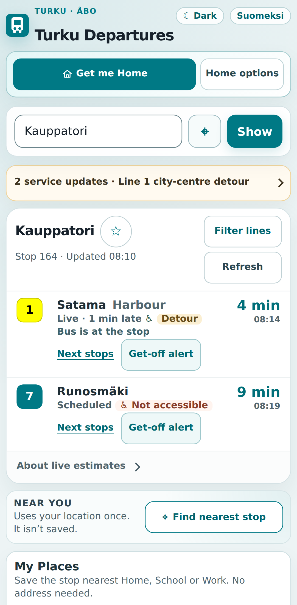
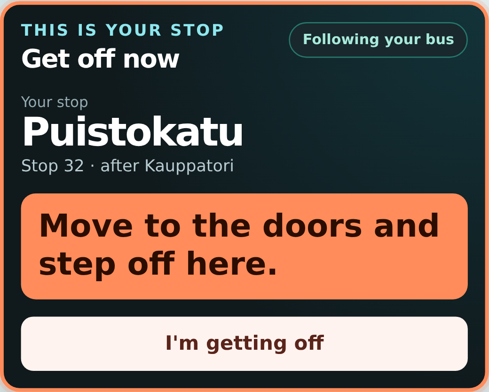
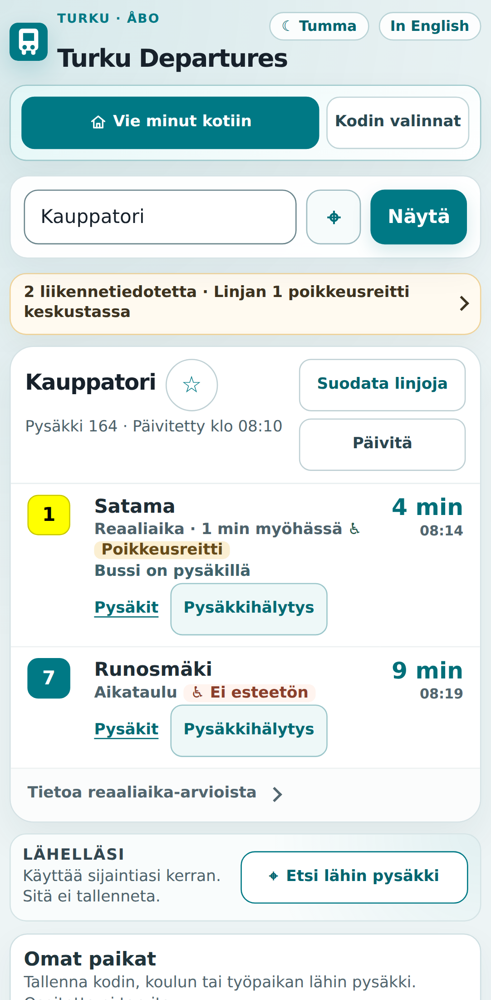

# Turku Departures


**Live departures, disruptions and get-off alerts for Turku — privacy-first, no account, no ads.**

[**Open Turku Departures →**](https://mykoladotsenko.github.io/foli-live-departures/) ·
[**Download Android APK ↓**](https://github.com/MykolaDotsenko/foli-live-departures/releases/download/android-latest/Turku-Departures.apk) ·
[Suomeksi](#suomeksi) ·
[Report a problem](https://github.com/MykolaDotsenko/foli-live-departures/issues/new?template=bug_report.yml)

> Independent project using Föli open data. Not made by or affiliated with Föli or the City of Turku.

### Current interface

<p align="center">
  
  &nbsp;
  
  &nbsp;
  
</p>

## Android APK

An installable Android sideload build is published from `master`:

[**Download Turku-Departures.apk →**](https://github.com/MykolaDotsenko/foli-live-departures/releases/download/android-latest/Turku-Departures.apk) ·
[SHA-256 checksum](https://github.com/MykolaDotsenko/foli-live-departures/releases/download/android-latest/Turku-Departures.apk.sha256)

The APK uses the same web application and Android permissions exercised by the repository's Android emulator E2E workflow. It is a GitHub-built prerelease for direct installation, not a Google Play release. Android may ask you to allow installs from your browser or file manager.

The downloadable APK is currently a debug-signed sideload build. Because CI runners do not hold a persistent production signing key, a later APK may require uninstalling the previous sideload build before installation.

## What the app does

| Passenger question | What the app does |
| --- | --- |
| What leaves next? | Live and scheduled times, each clearly marked |
| Is the trip disrupted? | Service updates shown with your stop and lines |
| Which stop is nearest? | Nearby stops from a one-time location check |
| When should I press STOP? | A get-off alert that tells you when to get ready, press STOP and get off |
| How do I get home? | Your saved Home stop, backup stops and Show to driver |
| What if the connection drops? | An installable app that says plainly what still works offline |

## Get-off alert

The alert follows your bus in Föli’s live data, knows the order of the stops on your trip, and can use your phone’s location if you allow it.

The alert moves through three steps:

```text
get ready → press STOP → get off now
```

A weak or off-route location is not trusted. The timetable alone can warn you early, but it never triggers **Get off now**.

The exact stop order is kept, including loop routes that visit the same stop more than once.

## Privacy and limits

- no account, ads or analytics;
- saved places are public stops, never street addresses;
- your location is not stored;
- your location during a ride stays on the phone;
- GitHub Pages and data.foli.fi receive the network requests needed to load the app and the bus data;
- in the web PWA, an address/place query is sent to OpenStreetMap Nominatim only after you press **Search**; typing and Föli-stop selection stay local, and repeated place searches are cached only for the browser session;
- the packaged Android app does **not** call public Nominatim directly; address/POI lookup is handed off to the official Turku journey planner while local Föli-stop search remains available;
- a Content-Security-Policy lets the page run only its own code and talk only to its approved Föli and web place-search origins; it is checked on every build and in every browser test.

A browser can pause a page in the background or on a locked phone, so the get-off alert does **not** promise lock-screen alerts. Reliable background alerts would need a server and Web Push.

Turku Departures is not a ticketing app and does not replace Föli's official journey planner.

## Suomeksi

**Turku Departures näyttää bussien reaaliaikaiset ajat ja häiriöt sekä kertoo, milloin painaa STOP-nappia.**

> Itsenäinen projekti, joka käyttää Fölin avointa dataa. Sovellus ei ole Fölin tai Turun kaupungin tekemä eikä niihin sidoksissa. Liput ja virallinen reittiopas: foli.fi.

- reaaliaikaiset ja aikataulun mukaiset lähdöt erotetaan toisistaan;
- pysäkkihälytys auttaa valmistautumaan oikeaan aikaan;
- tallennetut paikat ovat julkisia pysäkkejä, eivät osoitteita;
- ”Vie minut kotiin” ja varapysäkit auttavat, jos tavallinen matka ei onnistu;
- sijaintia käytetään vain pyydettäessä tai pysäkkihälytyksen aikana, jos sallit sen;
- ei käyttäjätiliä, mainoksia tai analytiikkaa.

[**Avaa Turku Departures →**](https://mykoladotsenko.github.io/foli-live-departures/) ·
[Ilmoita ongelmasta](https://github.com/MykolaDotsenko/foli-live-departures/issues/new?template=bug_report.yml)

## For developers

### The problem

Transit data is easy when everything is fresh and the passenger already knows the route. Real use is messier:

- realtime can become stale without the provider being completely down;
- GTFS trips can cross midnight or visit the same stop more than once;
- GPS can be weak, delayed or off-route;
- a passenger may need a useful fallback while offline;
- scheduled and realtime departures must not look equally certain.

Turku Departures keeps **live, scheduled, stale and unknown** states distinct instead of flattening them into one timestamp.

### How the get-off alert decides

The alert combines three independent signals:

1. **Föli's live bus data** (SIRI);
2. **the trip's exact stop order** from the timetable (GTFS), including loop routes that visit the same stop more than once;
3. **optional GPS on the phone, matched to the bus route**; weak or off-route fixes are ignored.

Timetable-only estimates can raise the early steps but never **Get off now**.

### Engineering edge cases

The code explicitly handles:

- responses arriving after the user switches stops;
- cross-stop cache contamination;
- stale realtime without a hard provider failure;
- loop routes and repeated stops;
- after-midnight GTFS times;
- poor/off-route GPS;
- stale vehicle positions;
- blocked local storage;
- service-worker deployment under a GitHub Pages subpath;
- upstream Föli API contract drift.

### Architecture

| Area | Technology |
| --- | --- |
| UI | React 18, CSS Modules |
| Build | Vite 8 |
| Types | TypeScript strict `checkJs` over JSDoc for the data layer (`src/api`, `src/utils`, `src/types`) |
| Transit data | Föli SIRI, GTFS, service alerts |
| HTTP | Axios |
| Local state | React hooks, Web Storage |
| Browser APIs | Geolocation, History, Service Worker, Notifications, Wake Lock, Web Audio |
| Testing | Vitest, Testing Library, Playwright, axe |
| Delivery | GitHub Actions + GitHub Pages, installable PWA |

```text
Föli SIRI + GTFS + Alerts
        │
        ▼
Provider boundary
normalization · validation · cache safety · typed contracts
        │
        ▼
React hooks
realtime · disruptions · places · connectivity · Ride Mode
        │
        ▼
Passenger UI
departures · alerts · get-off alerts · recovery
```

### Quality evidence

The verification suite covers:

- unit/integration tests with coverage reporting;
- Chromium, Firefox, mobile WebKit and mobile Chromium journeys;
- real service-worker/PWA behaviour;
- axe accessibility checks;
- 320–430 px mobile layouts and horizontal-overflow regression;
- 200% text scaling and touch-target checks;
- production bundle budget;
- live Föli API contract smoke tests;
- branding/reference consistency.

CI follows the same path:

```text
lint → typecheck → brand/reference checks → tests + coverage
→ production build → PWA + bundle verification
→ cross-browser E2E → accessibility
```

The production GitHub Pages deployment is triggered only after that CI workflow completes successfully on `master`.

### Run locally

Requires Node.js 20.19+.

```bash
npm ci
npm run dev
```

Full verification:

```bash
npm run lint
npm run typecheck
npm run verify:brand
npm run test:coverage
npm run verify:api-reference
npm run build
npm run verify:pwa
npm run verify:bundle
npm run verify:csp
npm run test:e2e
```

### Documentation

- [Product audit](docs/PRODUCT_AUDIT.md)
- [Journey Assistant specification](docs/JOURNEY_ASSISTANT_SPEC.md)
- [Journey Assistant UX implementation audit](docs/JOURNEY_ASSISTANT_UX_AUDIT.md)
- [Destination-aware Nearby design appendix](docs/DESTINATION_AWARE_NEARBY_SPEC.md)
- [Ride Mode design](docs/RIDE_MODE_SPEC.md)
- [Föli API reference](docs/FOLI_API_REFERENCE.md)
- [Localization notes](docs/LOCALIZATION.md)
- [Brand guide](docs/BRAND_GUIDE.md)

Transit/timetable data is maintained by Turku region public transport and distributed through data.foli.fi under **CC BY 4.0**.

Application source code is under the **MIT License**.
