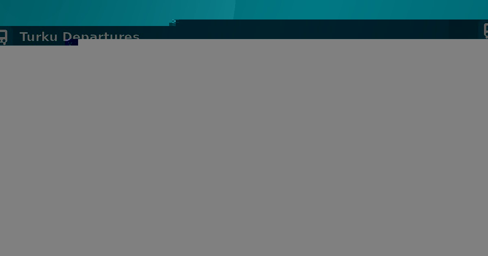
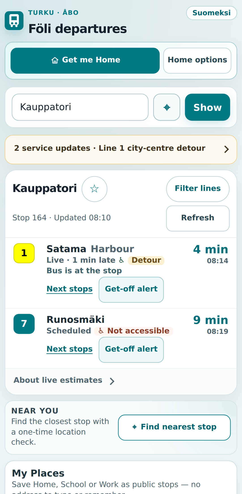
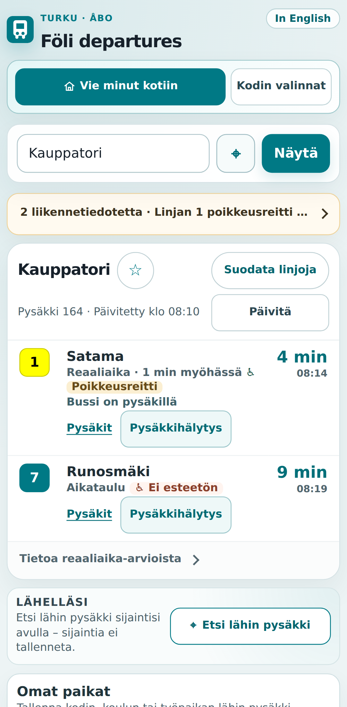

# Turku Departures

**Live bus times, disruptions & get-off alerts for Turku — privacy-first, no account, no ads.**

> **Know what leaves next. Know when to press STOP.**

[**Open Turku Departures →**](https://mykoladotsenko.github.io/foli-live-departures/)
· [Brand guide](docs/BRAND_GUIDE.md)
· [Product audit](docs/PRODUCT_AUDIT.md)
· [Contact](mailto:docnikolaj1990@gmail.com?subject=Turku%20Departures%20feedback)
· [Report a problem](https://github.com/MykolaDotsenko/foli-live-departures/issues/new?template=bug_report.yml)

> Independent project by **Mykola Dotsenko** using Föli open data. Not made by or affiliated with Föli or the City of Turku.

  
  &nbsp;
  
  &nbsp;
  

## Why it exists

A timetable is easy when everything goes right. Real passengers also need answers when:

- the bus is delayed or realtime becomes stale;
- a disruption changes the trip;
- the stop or route is unfamiliar;
- GPS or connectivity is unreliable;
- they are worried about missing their stop;
- they need a simple way to get home.

**Turku Departures is a decision layer between transport data and the passenger.**

It does not pretend uncertain data is certain. Live, scheduled, stale and unknown states are kept distinct.

## What users get

| Need | Product response |
| --- | --- |
| What leaves next? | Live + planned departures with explicit data state |
| Is my trip disrupted? | Service alerts in the context of the stop |
| Where is the closest useful stop? | One-tap location + nearby-stop comparison |
| When should I press STOP? | Get-off Alert using realtime, GTFS and optional GPS |
| How do I get home? | Saved Home stop, backup stops and route handoff |
| I am lost or stressed | Show-to-driver card and simple recovery actions |
| The connection dropped | Installable PWA with honest offline fallback |

## Get-off Alert

Choose a departure and the stop where you want to get off.

The app can guide the passenger through:

**get ready → press STOP → get off now**

Ride Mode combines:

1. **Föli SIRI realtime**;
2. **exact GTFS trip and stop order**;
3. **optional on-device GPS matched to the trip shape**.

Weak or off-route GPS is ignored. Timetable-only evidence can warn early, but it cannot trigger **Get off now**.

Exact GTFS stop sequence is preserved, including loop routes that visit the same stop more than once.

## Designed for real mobile use

The interface is tested for the situations that usually break transport apps:

- 320 / 360 / 390 / 430 px phone widths;
- portrait and landscape;
- 200% text scaling;
- light and dark themes;
- long Finnish and stop names;
- touch targets and safe areas;
- mobile keyboard contraction;
- browser Back / Forward;
- stale data, offline and provider failures.

Core actions stay reachable without horizontal scrolling.

## Privacy and trust

- No account.
- No ads.
- No analytics.
- Saved places use **public stop identities**, not street addresses.
- Device coordinates are not persisted.
- Optional ride GPS is processed on the device.
- The maker, contact channel, source code and problem-reporting path are visible in the product.

GitHub Pages and data.foli.fi still receive the network requests required to serve the app and transit data.

## Engineering

The infrastructure is intentionally small; the behaviour is not.

| Area | Technology |
| --- | --- |
| UI | React 18, CSS Modules |
| Build | Vite 8 |
| Data | Axios, Föli SIRI, GTFS, service alerts |
| Local state | React hooks, Web Storage |
| Browser APIs | Geolocation, History, Service Worker, Notifications, Wake Lock, Web Audio |
| Testing | Vitest, Testing Library, Playwright, axe |
| CI/CD | GitHub Actions + GitHub Pages |
| Delivery | Installable local-first PWA |

~~~text
Föli SIRI + GTFS + Alerts
        │
        ▼
Provider boundary
normalization · validation · cache safety
        │
        ▼
React hooks
realtime · disruptions · places · connectivity · Ride Mode
        │
        ▼
Passenger UI
departures · alerts · get-off guidance · recovery
~~~

The code explicitly handles:

- responses arriving after a stop switch;
- cross-stop cache contamination;
- stale realtime without a hard provider failure;
- loop routes and repeated stops;
- after-midnight GTFS times;
- poor or off-route GPS;
- stale vehicle positions;
- blocked local storage;
- service-worker deployment under a subpath;
- upstream Föli API contract drift.

## Quality evidence

Current verified release:

- **518 automated unit/integration tests across 48 test files**
- coverage: **85.78% statements / 79.62% branches / 88.61% functions / 88.84% lines**
- Playwright on **Chromium, Firefox, mobile WebKit and mobile Chromium**
- real service-worker PWA tests
- axe checks for WCAG A/AA, WCAG 2.1 AA and WCAG 2.2 AA
- mobile overflow, 200% text and touch-target regression tests
- production bundle budget
- live Föli API contract smoke tests
- branding consistency gate

CI verifies:

~~~text
lint → brand consistency → tests + coverage → API reference
→ production build → PWA verification → bundle budget
→ cross-browser E2E → accessibility
~~~

## Release status

The product is suitable for a **quiet public beta** and daily use for passengers who already know, or roughly know, their trip.

The strongest current use case is:

> **I know where I am going. Tell me what is happening now and help me not miss my stop.**

Before wider promotion, the highest-value validation work is:

- real-bus field testing on iPhone and Android;
- custom domain before acquiring many users;
- native Finnish copy review;
- Swedish UI;
- backend + Web Push if lock-screen Get-off Alert reliability becomes a product requirement.

## Honest boundaries

- A browser may suspend an open page in the background or on a locked phone.
- Get-off Alert therefore does **not** promise guaranteed lock-screen tracking.
- Reliable background alerts require the documented backend + Web Push phase.
- Föli vehicle coordinates are estimates, not raw GPS truth.
- Turku Departures does not replace official ticketing or full journey planning.
- The interface currently supports Finnish and English, not Swedish.

## Suomeksi

**Turku Departures näyttää bussien reaaliaikaiset ajat ja häiriöt sekä auttaa muistamaan, milloin pitää painaa STOP.**

- reaaliaikaiset ja aikataulun mukaiset lähdöt erotetaan toisistaan;
- Pysäkkihälytys auttaa valmistautumaan oikeaan aikaan;
- Koti, koulu ja työ tallennetaan julkisina pysäkkeinä, ei osoitteina;
- sijaintia käytetään vain pyydettäessä tai aktiivisen Pysäkkihälytyksen aikana;
- ei käyttäjätiliä, mainoksia tai analytiikkaa.

[**Avaa Turku Departures →**](https://mykoladotsenko.github.io/foli-live-departures/)

## Run locally

Requires Node.js 20.19+.

~~~bash
npm ci
npm run dev
~~~

Full verification:

~~~bash
npm run lint
npm run verify:brand
npm run test:coverage
npm run verify:api-reference
npm run build
npm run verify:pwa
npm run verify:bundle
npm run test:e2e
~~~

## Documentation

- **[Brand guide](docs/BRAND_GUIDE.md)** — naming, messaging, voice and trust rules
- **[Product positioning](docs/PRODUCT_POSITIONING.md)** — audience, alternatives and value
- **[Product audit](docs/PRODUCT_AUDIT.md)** — UX findings, release gates and known gaps
- **[Ride Mode design](docs/RIDE_MODE_SPEC.md)** — evidence model, state machine and Web Push phase
- **[Föli API reference](docs/FOLI_API_REFERENCE.md)** — provider contracts and fallbacks
- **[Localization notes](docs/LOCALIZATION.md)** — language architecture and review rules

## Data attribution

Transit and timetable data is maintained by Turku region public transport and distributed through data.foli.fi under **CC BY 4.0**.

Application source code is available under the **MIT License**.
